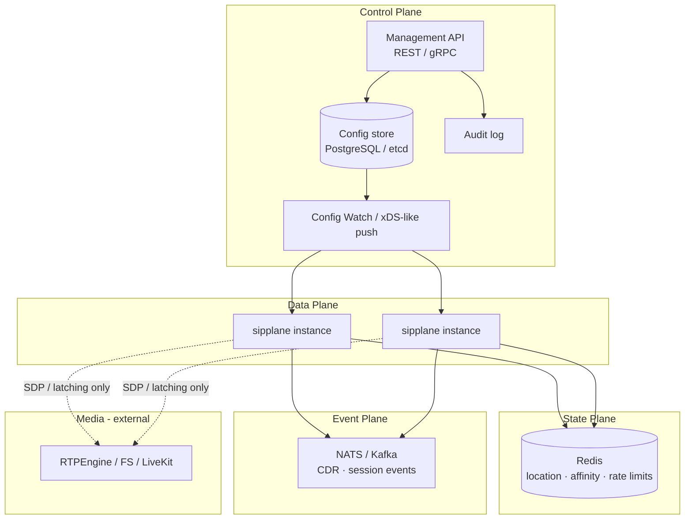

# Architecture

> Status: **Draft** — open for review. No production implementation yet.
>
> 中文版：[architecture.zh-CN.md](architecture.zh-CN.md)

## 1. Goals

sipplane is a **cloud-native SIP signaling plane**:

1. **Signaling first** — proxy, registrar, trunk routing, edge policy. Not a media server.
2. **Control / data plane split** — declarative resources, Watch-based hot updates, revisioned config.
3. **Cluster-ready state** — location and affinity live outside the process when scaled out.
4. **Reuse a proven SIP stack** — build on [sipgo](https://github.com/emiago/sipgo); do not reimplement RFC 3261 parsing/transactions.
5. **Go-native extensibility** — embeddable library + optional binary; plugins via gRPC / Wasm later.

Non-goals for v1:

- Full IMS / 3GPP CSCF replacement
- Transcoding or conference mixing
- Replacing FreeSWITCH / Asterisk as application servers
- A Kamailio-compatible `.cfg` dialect

## 2. Logical planes



| Plane | Responsibility | Latency path |
|-------|----------------|--------------|
| **Control** | CRUD resources, authz for operators, revisions, distribution | Slow path |
| **Data** | SIP I/O, transactions, routing decisions from **cached** snapshot | Fast path |
| **State** | REGISTER bindings, optional dialog stickiness, counters | Fast / shared |
| **Event** | Async CDR, webhooks, analytics | Async |
| **Media** | RTP/RTCP — out of process | Separate |

## 3. Data-plane internals (target)

```text
                    ┌──────────────────────────────────────┐
   SIP peers ──────►│ Transport (UDP/TCP/TLS/WS/WSS)       │
                    │              sipgo                    │
                    └──────────────────┬───────────────────┘
                                       │
                    ┌──────────────────▼───────────────────┐
                    │ Transaction layer (sipgo)            │
                    └──────────────────┬───────────────────┘
                                       │
         ┌─────────────────────────────┼─────────────────────────────┐
         ▼                             ▼                             ▼
   Registrar                    Stateful Proxy                  Options / health
   Auth · Location              Record-Route · fork             keepalive
         │                             │
         └──────────────┬──────────────┘
                        ▼
                 Routing Engine
            (cached Route / Trunk / ACL)
                        │
                        ▼
              Outbound client (sipgo)
```

Principles:

- **Authoritative config is never a local file alone.** Files may bootstrap; runtime truth is the control-plane snapshot + `revision`.
- **Hot path must not block on control-plane RPCs.** Misses use last-known-good + timeouts.
- **In-dialog messages** require either Call-ID affinity or globally visible dialog/route-set state.

## 4. Control-plane model

Resources (see [design/resource-model.md](design/resource-model.md)):

- `Tenant` — isolation boundary
- `Endpoint` — credentialed UA / PBX registration target
- `Trunk` — SIP peer / carrier interconnection
- `Route` — match → action (proxy, load-balance, reject)
- `DispatchGroup` — backend set + health policy (v0.3+)
- `ACL` / `RateLimit` — security policies

Distribution (inspired by Envoy xDS, simplified):

1. Operator writes resource via API (or GitOps applying the same API).
2. Control plane assigns monotonically increasing `revision`.
3. Data-plane agents **Watch** or long-poll; apply atomic snapshot swap.
4. Failed apply rolls back to previous revision; emit metric + alert.

## 5. State design

| Data | Single-node (v0.1) | Cluster (v0.3+) |
|------|--------------------|-----------------|
| AOR → Contacts | In-memory map | Redis hash + TTL ≈ Expires |
| Auth credentials | Config / file | Control plane → cached |
| Route tables | File / memory | Control-plane snapshot |
| Dialog affinity | Process-local | Redis or consistent hash |
| Rate limits | Local token bucket | Redis sliding window |

SIP constraints to respect:

- UDP is connectionless → prefer **shared state** over TCP sticky alone.
- Transaction timers are short → state store RTT budgets matter.
- `Record-Route` / `Path` / NAT — edge correctness before clever microservices.

## 6. Deployment shapes

### A. All-in-one (dev / small)

Single process: embedded control API + data plane + memory location.

### B. Split control / data (recommended production)

- `sipplane-control` — API, store, Watch server
- `sipplane` (data) — N replicas behind L4 / SIP-aware LB
- Redis for location
- Optional PostgreSQL for durable resource store

### C. Edge + core

- Edge pods: TLS termination, topology hiding, ACL
- Core pods: registrar + trunk routing
- Same resource model; different role labels

## 7. Observability

Minimum bar for v0.1+:

- Prometheus: CPS, method rates, transaction timeouts, route hits, register counts
- Structured logs: Call-ID, From/To tags, tenant, revision
- Health / readiness probes
- Later: HEP export to Homer, OpenTelemetry traces on control-plane RPCs

## 8. Security

- Digest auth for REGISTER / INVITE (as configured)
- mTLS between control and data planes (production)
- TLS/WSS for SIP where required
- No secrets in Git; credentials as references to secret stores
- Threat model document planned before v1.0

## 9. Repository layout (when code lands)

```text
sipplane/
  cmd/sipplane/           # data-plane binary
  cmd/sipplane-control/   # control-plane binary (may merge early)
  pkg/                    # public Go APIs for embedders
  internal/               # proxy, registrar, routing, store
  api/                    # protobuf / OpenAPI
  deploy/helm/            # later
  examples/               # SIPp, docker-compose
  docs/                   # architecture (this tree)
```

Implementation must not start until P0 docs are accepted (see ROADMAP). Early PRs should target docs and examples scaffolding only.

## 10. Open design questions

Tracked as GitHub Discussions / Issues:

1. Config store: PostgreSQL vs etcd vs both (API vs Watch backend)?
2. Affinity: Call-ID consistent hash vs fully shared dialog state?
3. Plugin ABI: gRPC-first vs Wasm-first for routing hooks?
4. Multi-tenancy keying in Redis: prefix vs Redis Cluster hash tags?

Please open a Discussion before large design PRs.
