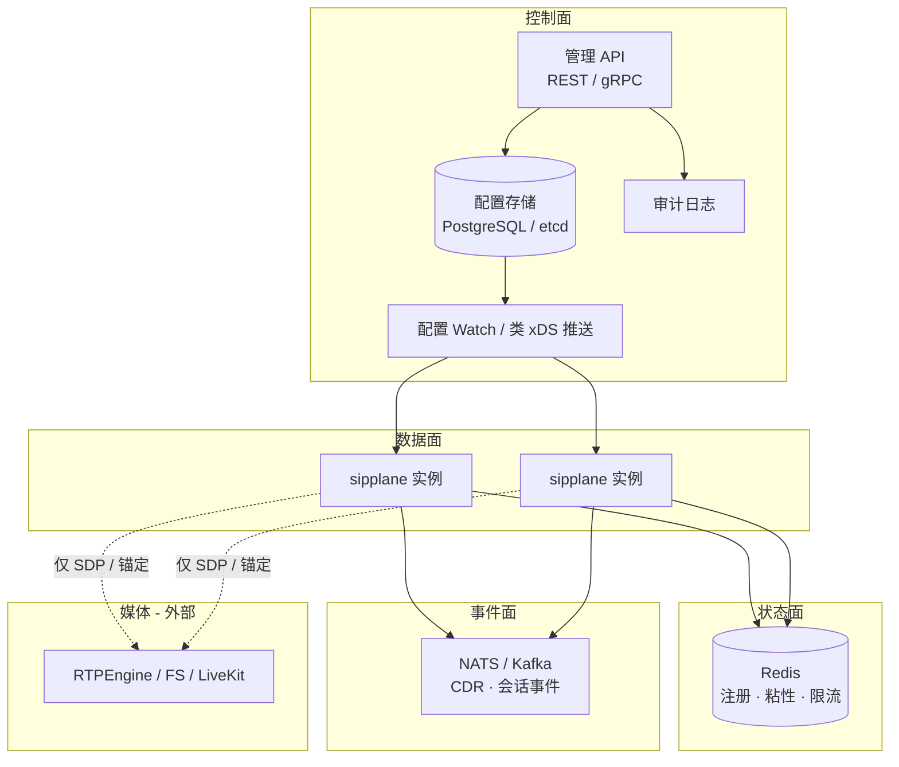

# 架构设计

> 状态：**草案**，欢迎评审。尚无生产实现。
>
> English: [architecture.md](architecture.md)

## 1. 目标

sipplane 是 **云原生 SIP 信令面**：

1. **信令优先** — 代理、注册、中继路由、边缘策略；不做媒体服务器。
2. **控制面 / 数据面分离** — 声明式资源、Watch 热更新、带 revision 的配置。
3. **集群就绪的状态** — 扩容后 location / 粘性外置。
4. **复用成熟 SIP 栈** — 基于 [sipgo](https://github.com/emiago/sipgo)，不重写 RFC 3261 解析与事务。
5. **Go 原生扩展** — 可嵌入库 + 可选二进制；后续 gRPC / Wasm 插件。

v1 非目标：完整 IMS、转码/会议、替代 FreeSWITCH 应用层、兼容 Kamailio cfg 方言。

## 2. 逻辑分层

| 面 | 职责 | 路径 |
|----|------|------|
| **控制面** | 资源 CRUD、运维鉴权、revision、下发 | 慢路径 |
| **数据面** | SIP I/O、事务、基于**缓存快照**的路由 | 快路径 |
| **状态面** | REGISTER 绑定、可选 dialog 粘性、计数 | 共享快路径 |
| **事件面** | 异步 CDR、Webhook、分析 | 异步 |
| **媒体** | RTP/RTCP — 进程外 | 独立 |

## 3. 数据面内部（目标形态）

原则：

- **权威配置不是本地文件。** 文件仅作 bootstrap；运行时真相是控制面快照 + `revision`。
- **热路径不阻塞在控制面 RPC。** 失败使用 last-known-good + 超时。
- **Dialog 内消息** 需要 Call-ID 亲和，或全局可见的 dialog / route-set 状态。

## 4. 控制面模型

资源见 [design/resource-model.zh-CN.md](design/resource-model.zh-CN.md)：

`Tenant` · `Endpoint` · `Trunk` · `Route` · `DispatchGroup` · `ACL` / `RateLimit`

下发流程（简化版 xDS）：

1. 运维通过 API（或 GitOps 调同一 API）写入资源。
2. 控制面分配单调递增 `revision`。
3. 数据面 Watch / 长轮询，原子替换快照。
4. 应用失败则回滚上一 revision，并打点告警。

## 5. 状态设计

| 数据 | 单机 v0.1 | 集群 v0.3+ |
|------|-----------|------------|
| AOR → Contacts | 内存 | Redis + TTL ≈ Expires |
| 路由表 | 文件 / 内存 | 控制面快照 |
| Dialog 粘性 | 进程内 | Redis 或一致性哈希 |
| 限流 | 本地令牌桶 | Redis 滑动窗口 |

须尊重的 SIP 约束：UDP 无连接、事务定时器短、`Record-Route` / `Path` / NAT 正确性优先于过度微服务化。

## 6. 部署形态

- **A. 一体机**：开发 / 小规模（内嵌 API + 数据面 + 内存 location）
- **B. 控制 / 数据分离**：生产推荐
- **C. 边缘 + 核心**：边缘做 TLS/ACL/拓扑隐藏，核心做注册与中继

## 7. 网关级能力（借鉴模式）

sipplane 主动吸收开源 HTTP/API 网关（APISIX、Kong、Traefik、Tyk、KrakenD、Easegress、Envoy/Istio、Caddy）的产品模式，并映射到 SIP。详见 **[design/gateway-patterns.zh-CN.md](design/gateway-patterns.zh-CN.md)**。

| 能力 | 目标行为 |
|------|----------|
| **策略链** | ingress → auth → routing → egress → async |
| **可观测** | Prometheus 标签、结构化 access log，后续 HEP + OTel |
| **控制/数据分离** | Admin API + revision Watch；控制面宕机数据面继续 |
| **服务发现** | Trunk / DispatchGroup；DNS SRV；后续 K8s Endpoints |
| **上游健康** | 主动 OPTIONS + 被动熔断；全挂返回 503 |
| **热更新** | 原子快照；先 validate / dry-run 再提交 |

## 8. 可观测性

v0.1+ 底线：Prometheus（含 `config_revision`）、结构化 access log（含 Call-ID / route / trunk / revision）、`/healthz` 与 `/readyz`；后续 HEP → Homer、控制面 OTel。

## 9. 开放问题

1. 配置存储：PostgreSQL vs etcd vs 两者分工？
2. 亲和：Call-ID 一致性哈希 vs 完全共享 dialog？
3. 插件：gRPC-first vs Wasm-first？
4. 多租户 Redis key 设计？
5. 发现默认：DNS SRV vs K8s EndpointSlice？

大改设计前请先开 GitHub Discussion。
